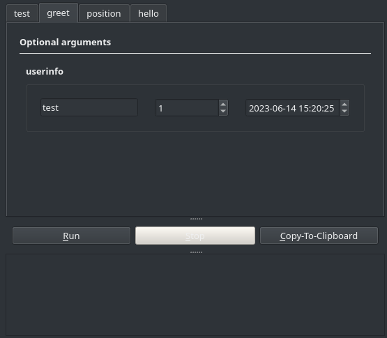
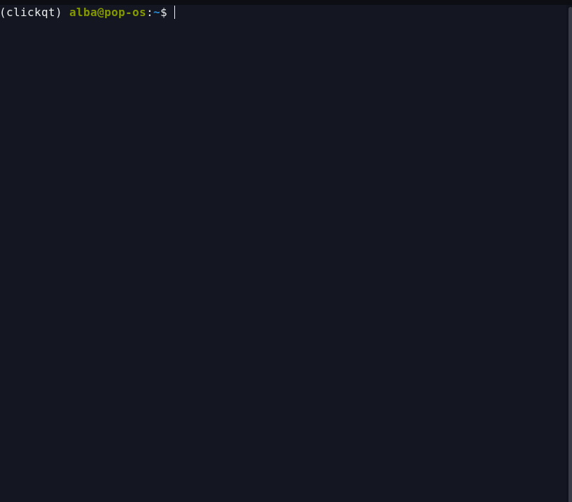

# Welcome to clickqt

[](https://opensource.org/licenses/MIT)
[](https://github.com/dokempf/clickqt/actions/workflows/ci.yml)
[](https://clickqt.readthedocs.io/)

**This is currently under active development between myself and a group of students**

## What is `clickqt`?
`clickqt` is a python package which turns `click`'s CLIs into `Qt`-GUIs.
Effectively, it turns
```
Usage: example_cli greet [OPTIONS]

Options:
  --userinfo <TEXT INTEGER DATETIME>...
  --help                          Show this message and exit.
```
into




## Installation

The Python package `clickqt` can be installed from PyPI:

```
python -m pip install clickqt
```

## Development installation

If you want to contribute to the development of `clickqt`, we recommend
the following editable installation from this repository:

```
git clone git@github.com:dokempf/clickqt.git
cd clickqt
python -m pip install --editable .[tests]
```

Having done so, the test suite can be run using `pytest`:

```
python -m pytest
```

## Usage




`clickqt` is designed to allow two ways of usage:
  ### External
To use `clickqt` externally, you can run the entry point created by installing `clickqt`, called `clickqtfy`.
There are two ways to use this entry point:
- ```
  clickqtfy ENTRYPOINT
  ```
This way works if you have an installed entry point.
- ```
  clickqtfy ENTRYPOINT FUNCNAME
  ```
In cases where there is no installed entry point, you can use this method instead, providing a path/filename for ENTRYPOINT and a function name within that file for FUNCNAME.

  ### Wrapper
You can create your own python file using `clickqt` like this:
``` python
from clickqt import qt_gui_from_click
import click

@click.command(...)
def foo(...):
  pass

qt_gui_from_click(foo)()
```


## Limitations

Currently clickqt only supports the built-in features from click.
This means that any user defined behaviour (e.g., custom ParamTypes / Commands / Contexts) will propably not work as expected.
Furthermore, clickqt handles envvar options diffently from click.
In particular clickqt always splits the envvar whereas click does this dependent on the ParamType.
Future releases will take these issues into account.

## Acknowledgments

This repository was set up using the [SSC Cookiecutter for Python Packages](https://github.com/ssciwr/cookiecutter-python-package).
